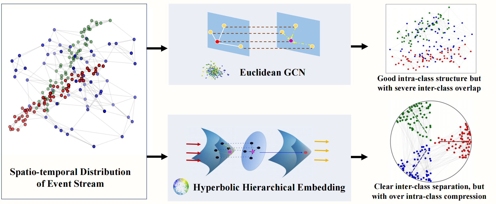
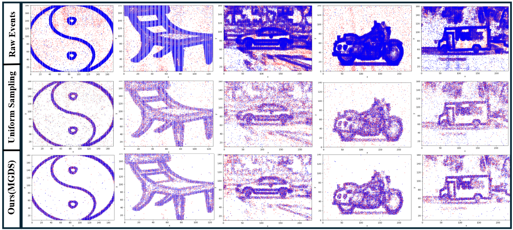
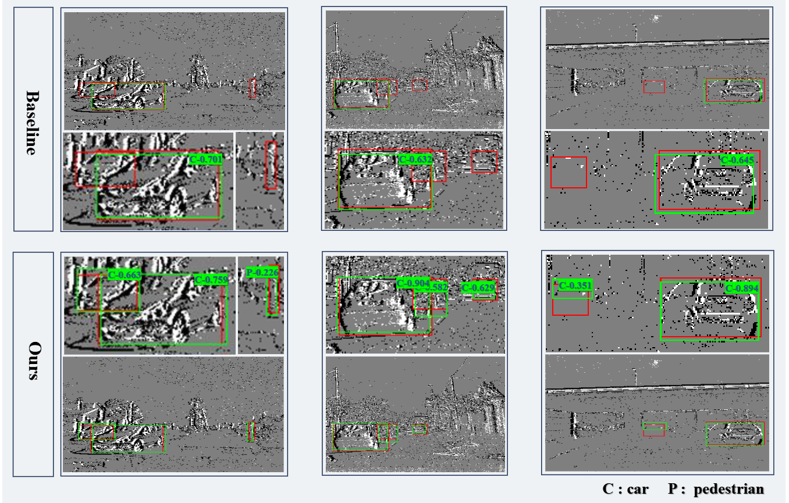

# __EHGCN: Hierarchical Euclidean-Hyperbolic Fusion via Motion-Aware GCN for Hybrid Event Stream Perception__

The Pipeline of EHGCN: Hierarchical Euclidean-Hyperbolic Fusion via Motion-Aware GCN for Hybrid Event Stream Perception

In this paper, we propose a novel approach named EHGCN, which, to the best of our knowledge, is the first attempt to perceive event stream in both Euclidean and hyperbolic spaces for event vision. In EHGCN, we introduce a multi-scale voxel grid Gaussian denoising and sampling strategy, retaining discriminative events while attenuating chaotic noise. Then, we present a Markov Random Field (MRF)-optimized motion-aware hyperedge generation method, which minimizes an energy function to explicitly capture consistent motion patterns within short time intervals, thereby eliminating cross-target spurious associations and providing critically topological priors while capturing long-range dependencies among events. Finally, we propose a Euclidean-hyperbolic GCN to fuse the information densely aggregated and hierarchically modeled in local Euclidean and global hyperbolic spaces, respectively, to achieve a hybrid event perception. 

Event camera data exhibit strong anisotropy in spatio-temporal distribution:

After modeling with Euclidean GCN, it shows clear intra-class structures in local neighborhoods, but with severe inter-class overlap. In contrast, hyperbolic space can clearly separate inter-class structures, but with excessive intra-class compression.

Visual comparison of events after sampling on the N-Caltech101 dataset.

Compared to widely used uniform sampling method, our approach preserves important details, such as the contours of objects and motion information, while suppressing background noise and redundant information.

Object detection visualization on the Gen1 dataset. 

The red boxes denote the ground-truth annotations, while the green boxes represent our detected bounding boxes, and the numbers represent the corresponding estimation confidences. The baseline method failed to fully detect the object, leading to missed detections, especially when object boundaries were unclear or the background was complex, resulting in lower detection accuracy. In contrast, our model successfully detected the object, with significantly improved bounding box precision. Compared to the baseline, our approach captures objects better in complex backgrounds through more accurate motion modeling and information fusion, significantly enhancing the accuracy of the bounding boxes and effectively reducing missed detections.

 ### __License__
This repository is licensed under the Creative Commons Attribution-NonCommercial 4.0 International License (CC BY-NC 4.0).
